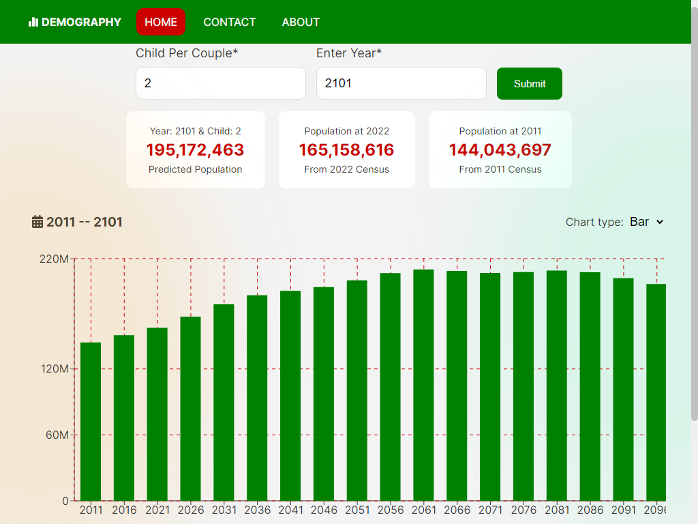

# Demography Project



## Overview

This Demographic Web Application is an undergraduate level project
developed as part of the academic curriculum in the Department of
[Electrical and Electronic Engineering](https://www.ru.ac.bd/eee/)
at
[University of Rajshahi.](https://www.ru.ac.bd)
The project aims to provide a user-friendly platform for projecting the
total population of Bangladesh based on user inputs. The application
utilizes Next.js, React, and various libraries to offer interactive
visualization and population trend analysis.

## Technologies Used

- [Next.js](https://nextjs.org/)
- [MongoDB](https://www.mongodb.com/)
- [Firebase](https://firebase.google.com)
- [React Hook Form](https://react-hook-form.com/)
- [Framer Motion](https://www.framer.com/api/motion)
- [Recharts](https://recharts.org/)
- [React Toastify](https://www.npmjs.com/package/react-toastify)
- [FontAwesome](https://fontawesome.com/)
- [numeral.js](http://numeraljs.com/)
- [SendGrid](https://sendgrid.com/)
- [React Spinners](https://www.davidhu.io/react-spinners/)

## Features

- Dynamic population projections based on user inputs
- Interactive graph with population trends visualization
- Customizable chart types (bar chart and line chart)
- Contact page to send feedback and inquiries
- Seamless client-side navigation using Next.js
- Responsive design for various screen sizes
- Utilizes Recharts libraries for data visualization

## Getting Started

1. Clone the repository:
   ```bash
   git clone https://github.com/arabin1/demography.git
   ```
   Make sure you have the following packages installed on your machine.

- [node](https://nodejs.org/en/download)
- [mongoDB](https://www.mongodb.com/docs/manual/installation/)

2. Install dependencies: `cd demography && npm install`
3. Run the development server: `npm run dev`
4. Access the application in your web browser at `http://localhost:3000`.

## Contributing

Contributions are welcome! If you'd like to contribute to this project, please follow these guidelines:

1. Fork the repository and clone it locally.
2. Create a new branch for your feature or bug fix.
3. Make your changes and commit them with descriptive commit messages.
4. Push your changes to your forked repository.
5. Submit a pull request, explaining your changes and their purpose.

## Limitations

- Population projections are based on assumptions and available data, and may not reflect accurate figures.
- The application is limited to projecting the population of Bangladesh from 2011 to 2101 and does not provide projections beyond this time frame.

## License

This project is licensed under the [MIT License](LICENSE).

## Credits

Supervisor: [Dr. Mamun-Ur-Rashid Khandker](http://rurfid.ru.ac.bd/ru_profile/public/teacher/25400487/profile) (Department of EEE, University of Rajshahi)

## Contact

For any questions, feedback, or inquiries, please use the contact page
in the application to get in touch with the project team or
feel free to reach out to me [Md. Asaduzzaman (Arabin)](mailto:aznarabin@gmail.com).

---
